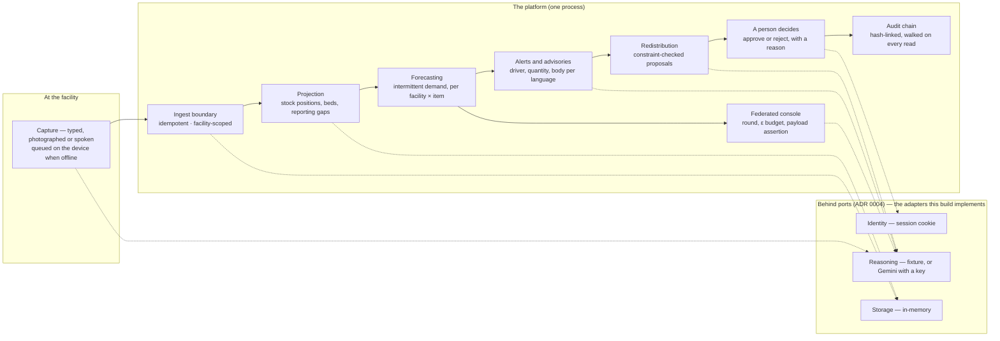

# Civora

Civora is a federated AI platform for India's public health supply chain. A
primary health centre records stock — typed, photographed or spoken, and queued
on the device when there is no connection — and the platform forecasts what each
facility and item will need, raises early warning with the evidence beside it,
proposes transfers that respect every safety constraint, and records a person's
approval in a hash-chained audit trail. **Planning is deterministic; a language
model extracts and explains, and never authors a quantity that reaches the
record.** The national network it runs on is simulated from a fixed seed,
labelled as simulated everywhere it appears, and reproducible byte for byte.

> **Status — read this first: the deployment serves the product, with one
> measured exception.** No Google Cloud project, billing account or container
> runtime exists on the machine this was built on, so the primary path is
> unexecuted; the declared non-Google fallback was created instead, and since
> 2026-09-30 it answers: the store-backed reads — the front page, `/command`,
> `/readyz` — measured **0.15–0.61 s** from outside, against **51.7–56.2 s and
> intermittent 502** for the same reads before the world build moved off the
> request path (§8.7). **The live url is
> [`https://civora-web.onrender.com`](https://civora-web.onrender.com).** Two
> limits belong beside it, both measured: the free instance spins down when idle,
> so a first visit after a quiet spell waits out a ~41 s warm, and the first read
> of the control tower's country scan takes **51.33 s measured**, during which the
> host answers other visitors with **502** (§8.8). Everything else is in
> the repository and every gate is green: the seeded national simulation,
> intermittent-demand forecasting with a published evaluation, the risk inbox
> and early warning, constraint-checked redistribution a person decides on, the
> federated console with its privacy budget, offline capture, HMIS/NLEM interop,
> five languages, and a reasoning layer that **has been executed against a real
> Gemini model**. [What this build does not
> claim](#what-this-build-does-not-claim) names every gap.

### Submission artefacts

| Artefact                             | State                                                                                                                                                                                                                                                                                                                                                                                                                                                                                                                                                                                                                                                                                                                                                                 |
| ------------------------------------ | --------------------------------------------------------------------------------------------------------------------------------------------------------------------------------------------------------------------------------------------------------------------------------------------------------------------------------------------------------------------------------------------------------------------------------------------------------------------------------------------------------------------------------------------------------------------------------------------------------------------------------------------------------------------------------------------------------------------------------------------------------------------- |
| **Source code**                      | This repository. Five commands below take a clone to a running, seeded platform, with no cloud account.                                                                                                                                                                                                                                                                                                                                                                                                                                                                                                                                                                                                                                                               |
| **Live link**                        | **`https://civora-web.onrender.com` — deployed, and serving.** Measured from outside, logged out, on 2026-09-30: `/healthz` **200 in 0.28 s**, `/readyz` **200 in 0.42 s**, the front page **200 in 0.61 s**, `/command` **200 in 0.45 s** — against **51.7–56.2 s and intermittent 502** for the same reads before the world build moved to start-up (§8.7). Two limits are measured and stated rather than left to be discovered: the free instance spins down when idle, so a first visit after a quiet spell waits out a ~41 s warm, and the first read of the control tower's country scan is **51.33 s**, answering other visitors **502** while it runs (§8.8). [`docs/DEPLOYMENT.md`](docs/DEPLOYMENT.md) §10 lists every step a real run still has to prove. |
| **Demo video**                       | **Recorded, awaiting upload.** 3 m 58 s, 1920×1080 at 30 fps, 24 burned-in captions plus an SRT, a generated music bed, a drawn cursor on every input, and the platform's own provenance disclosures on screen where the model produces data — captured from the running prototype as a live take of all eight beats in the demo script, not slides. The file is 79 MB; its URL goes in this row once it is uploaded.                                                                                                                                                                                                                                                                                                                                                 |
| **Pitch deck and brief description** | Written, and every figure in them traces to a command whose output is retained in this repository's documentation — no number in either is an estimate.                                                                                                                                                                                                                                                                                                                                                                                                                                                                                                                                                                                                               |
| **Container image**                  | **Builds, and has never run.** CI's `container` job (`docker build -f infra/Dockerfile`) is green on `41af8d1`, `594e450`, `0830ca0` and `541a1ac` (the first build of the current interface) — so the image is known to build on a builder that is not this machine; no container of it has ever started, and the local check needs a container runtime (B8).                                                                                                                                                                                                                                                                                                                                                                                                        |

### The loop, in one picture



The same loop is asserted in the browser, end to end, by `e2e/` — a capture is
recorded offline, delivered when the platform is reachable, forecast into an
alert, written into an advisory, proposed as a transfer, decided by a named
person and found in the audit chain afterwards.

---

## The problem

Primary health centres run out of essential medicines that are sitting unused a
district away, because stock positions are reported too late, too coarsely or not
at all — and a facility that has no stock and a facility that has no patients
look identical in the records.

The consequence is avoidable: a platform that can tell the difference, predict
demand per facility, and propose a transfer that respects every safety constraint
turns a national shortage into a routing problem.

## What this does, end to end

A **capture** at one facility — typed, photographed or spoken, and queued on the
device when there is no connection — reaches the ledger through one ingest
boundary, idempotently and scoped to the facility that sent it. From there the
platform **forecasts** consumption per facility and item, **raises alerts** with
the quantity that put each one there, **proposes transfers** that respect shelf
life, cold chain and handling limits, and **records a person's decision** on each
proposal in a hash-chained audit trail. A **console** shows the federated
learning round, its privacy budget and the honest measurement of what the noise
costs.

`pnpm test` runs the simulator against the same seeded inputs every time, and its
scenarios — a monsoon surge, a diarrhoeal outbreak, a facility that goes offline,
a disrupted state warehouse, a cold-chain failure, a district expiry cliff — are
asserted to produce the effects they are named for, alongside two negative
controls that are asserted to produce nothing at all.

`pnpm db:seed` generates that dataset and stores it through the persistence port,
and running it again stores the same documents under the same identifiers. What
the dataset is, how much of it is real rather than generated, and which sources
it set out to use but could not obtain are all on the **dataset inspector** at
<http://localhost:3000/dataset>.

The **capture surface** at <http://localhost:3000/capture> queues what a facility
records on the device and delivers it when the platform can be reached; the
**visibility surface** at <http://localhost:3000/visibility> reads the resulting
stock positions, bed pressure and reporting gaps; and the **control tower** at
<http://localhost:3000/command> drills from the national picture to a batch. Turn
the network off in the browser and capture anyway: that is the path the platform
is built around, and `docs/ARCHITECTURE.md` states each rule it rests on and the
file that enforces it. The capture screen is also stored on the device once it
has been opened, so it reopens with no connection at all — the form, the queue
and what each holds — while the platform's own facility list is deliberately not
stored, because a list of facilities is a statement about the world that only
the platform is entitled to make.

## Quickstart — five commands from a clone to the running platform

Requires **Node 22 or newer** and **pnpm 10**. No cloud account, no credentials,
no configuration, and the five commands are the whole of it:

```bash
git clone https://github.com/DHBhensdadia/Civora.git
cd Civora/Source
pnpm bootstrap   # installs the workspace, creates .env.local, fetches Chromium
pnpm db:seed     # generates the demonstration dataset and stores it
pnpm dev         # http://localhost:3000
```

`pnpm bootstrap` runs `pnpm install`, creates `.env.local` from `.env.example`,
and fetches the browser the end-to-end tests use. `pnpm db:seed` builds the
demonstration world — 90 facilities across 30 districts in six states, 208 days
of history for twelve of them, and the ledger the surfaces read (1,73,564
entries) —
from the fixed seed, so two people running it get the same world, document for
document. `pnpm dev` starts the application on <http://localhost:3000>, with the
Firebase emulator suite if it is available. The dataset is optional for looking
at the interface and necessary for the numbers in it to mean anything;
`http://localhost:3000/dataset` shows exactly what was generated.

The repository is private today by owner choice: the evaluation account is
granted access as a submission step, and the clone URL above is the one it uses.

(The script is `bootstrap` rather than `setup` because `pnpm setup` is a reserved
command that reconfigures your shell.)

Explicitly, this runs with **zero cloud credentials**. That is a design
constraint, not a fallback: every external boundary is a port with a local
adapter behind it, so the system is developed, tested and demoed without a cloud
account. Pointing it at a real backend is a configuration change.

## Layout

```
apps/
  web/          Next.js application — dashboard, capture surface, console
  worker/       Scheduled jobs: forecast batches, alerts, federation rounds
  simulator/    Deterministic generator for the synthetic facility network
packages/
  domain/       Schemas, boundary ports, local-first adapters
  forecasting/  Intermittent-demand forecasting engines
  optimizer/    Redistribution planning and constraint validation
  federated/    Federation rounds and differential-privacy accounting
  ai/           Adapters behind the reasoning port
  interop/      Importers for incumbent health-system formats
  i18n/         Locale bundles and formatting
  config/       Shared TypeScript, ESLint and Prettier presets
infra/          Container image, emulator configuration, deploy scripts
e2e/            Browser tests against the real application
docs/           Provenance, architecture, evaluation and plan notes
```

## Architecture

Three ideas carry the design.

**Ports at every boundary.** Storage, identity and reasoning are each an
interface in `packages/domain` with a local implementation behind it. The web
application composes them from validated configuration in one place, so swapping
an adapter touches nothing downstream.

**Simulation is labelled.** The platform is designed around a generated national
network, and simulated data is marked as simulated in the interface, in API
responses and in the documentation. A reader should never have to guess which
parts are real.

**Numbers are decided, not generated.** Planning and forecasting are
deterministic engines. A language model may explain a decision in the user's
language; it never authors a quantity that reaches the record.

**Every consequential decision is chained, and the chain is walked rather than
asserted.** A stock correction, an alert move, a transfer decision, an import and
a federated round each append an `AuditEvent` carrying who decided, in what
capacity, when, on what grounds, what changed — the on-hand figure before and
after, the state an alert left and entered — and the digest of the entry before
it. Altering one, removing one or reordering two breaks the chain at the point of
the change, so `/audit` reports _where_ it stops holding rather than that
something is wrong — and it reports that for the whole chain even when a reader
has filtered the rows to one actor, because a trail that held only inside the
rows somebody asked for would be a trail that can be broken anywhere else. The
viewer reads the chain through the same rule as the stored rules
(`infra/firestore.rules`), which is why a district officer is refused it in a
sentence: a decision is a line in one shared record, and reading it would mean
reading every other district's.

What is _not_ recorded is stated as plainly as what is: a refused action, a
replay, a read, a conflict (which is written to its own collection) and the
platform's own recomputations. `apps/web/src/lib/audit-service.ts` holds that list
as a value — the action vocabulary the chain accepts — and
`audit-service.test.ts` reads every file the list names, asserts each one appends
to the chain, and then asserts the converse: every file in the application that
appends to the chain is registered. A new consequential action that skips the
chain is a failing test rather than a second code path nobody reviewed.

**The tenancy model is written down where a deployment's data would live, and
enforced in the routes this build runs.** `infra/firestore.rules` implements the
roles and scopes the application uses, so in the pilot shape a read the database
refuses cannot be forgotten by a route — and the same rules are asserted against
the emulator here. The demonstration itself stores nothing outside its own
process (the in-memory adapter), and its scoping is enforced in the session and
route rules the specs assert: custom claims carry the role and the
place it is anchored to, one lookup up the facility spine resolves a district or
a state, and only alerts and transfer decisions accept a client write at all.
`pnpm test:rules` starts the Firestore emulator and runs twenty-five cases
against it, each access asserted twice — the access a role is meant to have and
the neighbouring access it must not.

**A file from a system the ministry already runs is a record like any other.** Three
readers live in `packages/interop`: the monthly HMIS stock statement, the Local
Government Directory extract and the national essential medicines list. The first
two are on the import path — `/import` is a two-step, **check** and then **accept**,
where the check runs the same code with writing turned off and reports per row what
the platform would do, including the rows it refuses and the sentence it refuses
them with. An importer does not decide what to write: the adapter reads the file into
the envelope a nurse's phone sends, and the ingest boundary decides each row — the
same idempotency keys, the same projection, the same audit chain — so an imported row
differs from a capture only by its source and by the provenance naming the file it
arrived in. Re-importing is a replay rather than a second movement of the same stock
(each row's identifier is derived from its own content and the file's digest), scope
is decided per row, and the act appends one `import-accepted` entry naming the file,
the rows it wrote and the person who accepted it. Every correspondence is
field-by-field and held in the code as a value, so a column the reader needs but the
table does not name fails the build: [`docs/INTEROP.md`](docs/INTEROP.md) prints
them, and says which shapes were confirmed against a retrieved source and which are
reconstructed.

**What an operator can see from outside is three small things, and the third can
fail.** A log line is one JSON object carrying the request's correlation id, minted
or taken from the caller and echoed on the response — never the query string, which
is where an identifier arrives when nobody meant to send one — and a field whose key
looks like a person's is withheld and _named_ in the line that would have carried it.
`/healthz` says the process is alive; `/readyz` says whether it should be given a
decision, reading the store, the dataset, the projection and **the audit chain**, so
a trail that has been altered is reported as not-ready with the entry named rather
than served as though nothing were wrong. `/api/metrics` is the operator's read —
chain entries and their actions, imported files and what they wrote, the control
tower's own cache counters, the reasoning adapter's calls and cache hits — every
figure read through the mechanism that already owns it, with `null` rather than zero
for anything nobody has measured.

**Localisation is partial, and the partiality is stated.** Two flows are
translated into English, Hindi, Marathi, Bengali and Tamil: **the
medicine-capture form** — its facility, item, movement, quantity, batch, expiry
and reason fields, its queue and refusal messages — and **the alert inbox** —
severity, state, raised-on date, the reason field and the five move buttons.
`@civora/i18n` holds the bundles, a bundle missing a phrase fails the build, and
dates, counts and percentages are rendered by the language's own locale rather
than by string replacement, so Hindi renders Devanagari numerals (asserted in
`e2e/i18n.spec.ts`). **The remaining hard-coded surfaces, named rather than
implied:** the navigation; the capture page's own framing prose and its other
four record kinds (adjustment, bed status, staff attendance, syndromic counts);
the visibility surface; the control tower and its drill-down; the redistribution
workbench; the federation console; the dataset inspector; the vision and voice
review screens; the advisory panel; the provenance page; and the ranked risk
catalogue with every driver sentence beside it. **Generated prose is whatever a
model wrote**, and an alert that holds no body in the language a reader is
reading says so rather than showing another language's words in its place —
`bodyIn` in `packages/i18n` is the rule, the advisory panel is where it is
visible, and the alert inbox's read-aloud control is that refusal in audio: a
body is spoken only in the language the record carries it in, with the voice
asked for in the registry's plain speech tag (`hi-IN`, never
`hi-IN-u-nu-deva`, which matches no installed voice).

## Google AI

**The Google technologies, named, with what each has actually done here:**

| Google technology                                                                              | Where it is                                                                                                                              | What has been executed                                                                                                                                                                                                                                                                                      |
| ---------------------------------------------------------------------------------------------- | ---------------------------------------------------------------------------------------------------------------------------------------- | ----------------------------------------------------------------------------------------------------------------------------------------------------------------------------------------------------------------------------------------------------------------------------------------------------------- |
| **Gemini** (the `@google/genai` interactions API)                                              | `packages/ai` — `GeminiReasoningProvider` behind the `ReasoningProvider` port: five registered prompts, each schema-locked and grounded  | **Executed** against `gemini-3.1-flash-lite`: a register page read into the ledger, a recording heard and written only after a person confirmed it, advisories **6/6**, transfer rationales **6/6**, round narratives **4/4** — with calls, tokens, refusals and milliseconds counted by the adapter itself |
| **BigQuery ML** (`AI.FORECAST` over **TimesFM 2.0**, and `ML.FORECAST` with `ARIMA_PLUS_XREG`) | `packages/forecasting/src/bqml.ts` — the same forecast contract as the local engine, behind the same port                                | **SQL built and unit-tested; never executed.** It needs a Google Cloud project and billing, and neither exists, so every published evaluation figure comes from the local engine and `docs/EVALUATION.md` says so in its own row                                                                            |
| **Federated learning** (the cross-silo reference architecture)                                 | `packages/federated` and the console — FedAvg/FedProx, update clipping, Gaussian noise, an RDP accountant, a per-round payload assertion | **Executed locally** over six partitioned silos: six rounds, ε **7.9999** at δ 1e-5, and the console publishes what the noise costs rather than claiming it is free                                                                                                                                         |

Behind all three is the `ReasoningProvider` port defined in `packages/domain`.
The adapter is contract-tested, and every response is validated against the
caller's schema before it leaves it; a narrative that states a number nobody
computed is refused. The five wired tasks are register extraction,
spoken-command parsing, advisory bodies, transfer rationales and the federation's
round narrative — and the layer **has been executed against a real model**: a
rendered register page read into the ledger, a spoken update heard, held and
written only after a person confirmed it, six advisories written in two
languages, six transfer rationales and four round narratives.
[`docs/AI_APPROACH.md`](docs/AI_APPROACH.md) is the adversarial review of exactly
this layer — every call site, and what breaks in each one when the model returns
nothing.

That run is gated and reproducible — `CIVORA_LIVE_AI=1 pnpm e2e live-ai.spec.ts`
— and with no key configured every surface shows the writer's own refusal rather
than a substitute, because the recorded-fixture adapter refuses rather than
pretends. Every attempt, refusal, cache hit, token and millisecond is counted by
the adapter itself and shown on the intelligence surface, so what a burst would
cost is the platform's own figure rather than an estimate. The free tier's
ceiling on one model — **twenty requests a day**, measured off a real `429`
rather than read from documentation — is why the demonstration pins
`gemini-3.1-flash-lite` and why the advisory set is written ahead of the demo
rather than during it.

`pnpm check:bundle` is the standing check that none of this is reachable from the
browser: it reads the built client bundle and fails if the reasoning endpoint, the
SDK client or the key's name appears in it, with two positive controls so the
check cannot pass by scanning nothing.

`pnpm ai:eval` is how that layer is checked, in two modes that answer different
questions. `--grounding` injects an alert whose facts are a seven-digit figure, a
negative change and a three-place decimal, states for each draft whether it may be
published, and **fails unless every accepted draft stops being accepted once a
figure nobody measured is put in it** — a check that accepts everything and a
check that rejects everything both look like a green run, so it proves it is
neither, and it needs no key. `--golden-set` scores recorded readings against
hand-written labels, and a case is only a case if its response came from a real
call: the command, the day and the digest of the media it answers are all required,
and a corpus file without them is **refused by name** rather than quietly skipped.
No provenance-bearing corpus exists, so that mode still prints `NOT MEASURED`
with the reason and **no percentage at all** — a rate over nothing is not a
measurement — and exits `2`, which CI accepts and prints that it saw. That gap is
named rather than papered over: the evaluation plan asks for a measured
extraction accuracy, and this build does not have one.

## Results

Every figure below was produced by the command beside it, at the commit this
README describes. Nothing here is an estimate, and the two gates that could not
run are named rather than omitted.

| Gate                       | Command                                              | Result                                                                                                                                                                                                                                                                                                                                                                                                                                                                             |
| -------------------------- | ---------------------------------------------------- | ---------------------------------------------------------------------------------------------------------------------------------------------------------------------------------------------------------------------------------------------------------------------------------------------------------------------------------------------------------------------------------------------------------------------------------------------------------------------------------- |
| Types, lint, formatting    | `pnpm typecheck` · `pnpm lint` · `pnpm format:check` | zero errors                                                                                                                                                                                                                                                                                                                                                                                                                                                                        |
| Unit and property tests    | `pnpm test`                                          | **78 files, 788 tests**, all passing                                                                                                                                                                                                                                                                                                                                                                                                                                               |
| Firestore rules            | `pnpm test:rules`                                    | **25 cases**, each access asserted allowed and denied                                                                                                                                                                                                                                                                                                                                                                                                                              |
| Interoperability contracts | `pnpm --filter @civora/interop test`                 | **4 files, 33 tests** — every fixture parses                                                                                                                                                                                                                                                                                                                                                                                                                                       |
| Browser journeys           | `CI=1 pnpm e2e`                                      | **109 passed, 0 flaky, 9 skipped with their reason printed** (five gated live-model journeys, four gated live-smoke ones)                                                                                                                                                                                                                                                                                                                                                          |
| Grounding evaluation       | `pnpm ai:eval --grounding`                           | **PASS, exit 0** — 9 adversarial cases, the rule shown refusing an ungrounded draft                                                                                                                                                                                                                                                                                                                                                                                                |
| Extraction accuracy        | `pnpm ai:eval --golden-set`                          | **`NOT MEASURED`, exit 2** — a case needs real-call provenance, and no labelled corpus exists                                                                                                                                                                                                                                                                                                                                                                                      |
| Forecasting backtest       | `pnpm forecast:backtest`                             | report regenerated and committed ([`docs/EVALUATION.md`](docs/EVALUATION.md)); re-running reproduces every figure, changing only the date and the measured runtime                                                                                                                                                                                                                                                                                                                 |
| Federated round            | `pnpm fl:run --dp`                                   | six silos, six rounds, **ε 7.9999** at δ 1e-5, digest `sha256:b0d37c69…` reproduced across runs                                                                                                                                                                                                                                                                                                                                                                                    |
| Live reasoning             | `CIVORA_LIVE_AI=1 pnpm e2e live-ai.spec.ts`          | **5 journeys passed** against `gemini-3.1-flash-lite`: advisories 6/6, rationales 6/6, narratives 4/4, a register read and a recording confirmed                                                                                                                                                                                                                                                                                                                                   |
| Client bundle              | `pnpm check:bundle`                                  | **34 client files, 13,66,165 bytes** — no reasoning endpoint, SDK class, key name or provider config, with both positive controls firing                                                                                                                                                                                                                                                                                                                                           |
| Dependencies               | `pnpm audit --audit-level high`                      | **0 high**, 2 moderate (named in the audit output)                                                                                                                                                                                                                                                                                                                                                                                                                                 |
| Container image            | `docker build`                                       | **Builds in CI, never run.** Green on `41af8d1`, `594e450`, `0830ca0` and `541a1ac`; the local `check-image.sh` assertions need a container runtime (B8), and Cloud Build and the fallback host build the same Dockerfile remotely, which is why this does not block a deployment                                                                                                                                                                                                  |
| Deployed end-to-end        | `CIVORA_LIVE_URL=… pnpm smoke:live`                  | **Not run yet — and now it can be.** The Blueprint is live and its store-backed reads measured **0.15–0.61 s** from outside on 2026-09-30 (§8.7), where they were **51.7–56.2 s**, intermittently **502**, before the world build moved to start-up; the control tower's first country scan is still **51.33 s** (§8.8), which is why the smoke run is scheduled rather than spent. The spec is written and executes against the production build locally in three instance states |

## What the brief asks for, and where it is

| The ask                                               | Where it lives                                                       | The evidence that holds it                                                                                                                    |
| ----------------------------------------------------- | -------------------------------------------------------------------- | --------------------------------------------------------------------------------------------------------------------------------------------- |
| Offline, low-connectivity capture                     | `apps/web/src/app/capture`, the ingest boundary in `packages/domain` | `e2e/capture.spec.ts` — the screen reopens with no connection, the queue replays, a duplicate delivery is a replay                            |
| One ledger, no double counting                        | the ingest boundary's idempotency keys and projection                | `e2e/capture.spec.ts`, and the domain tests that fire the same submission twice                                                               |
| Intermittent-demand forecasting per facility and item | `packages/forecasting` (censored-demand correction, then the engine) | [`docs/EVALUATION.md`](docs/EVALUATION.md) — the backtest over 4,734 origins and 33,138 scored days                                           |
| Early warning with its evidence beside it             | the intelligence surface and the alert records                       | `e2e/risk-inbox.spec.ts`; every alert carries the quantity that put it there                                                                  |
| Constraint-checked redistribution a person decides on | `packages/optimizer` — the validator is separate from the solver     | `e2e/redistribution.spec.ts`; [`docs/REDISTRIBUTION.md`](docs/REDISTRIBUTION.md)                                                              |
| A record of who decided what, and why                 | `apps/web/src/lib/audit-service.ts` and `/audit`                     | `e2e/audit-chain.spec.ts`; the registry-completeness test reads every writer                                                                  |
| Federated learning with a stated privacy budget       | `packages/federated` and the console                                 | `pnpm fl:run --dp`; the console's ε curve and payload assertion                                                                               |
| Interoperability with systems already in place        | `packages/interop`                                                   | [`docs/INTEROP.md`](docs/INTEROP.md); `e2e/import.spec.ts` — check, then accept                                                               |
| Tenancy enforced where the data lives                 | `infra/firestore.rules`                                              | `pnpm test:rules` — 25 cases, each asserted both ways                                                                                         |
| Five languages, properly rendered                     | `packages/i18n`                                                      | `e2e/i18n.spec.ts` — Devanagari numerals asserted, not string substitution                                                                    |
| A model that never authors a quantity                 | `packages/ai/src/grounding.ts`                                       | `pnpm ai:eval --grounding`, a CI gate                                                                                                         |
| Deployability and scale                               | `infra/`, [`docs/DEPLOYMENT.md`](docs/DEPLOYMENT.md)                 | every script dry-run and failure path executed; the free-tier arithmetic is in the document, and §10 names what a real run still has to prove |

## Deployment

**There is a deployment, and it serves the product's read paths.** The machine
this was built on has no Google Cloud project, no billing account and no running
container runtime, so nothing was provisioned on the primary path; the declared
non-Google fallback was created instead. What it does is measured, not assumed:
the service is live at [`https://civora-web.onrender.com`](https://civora-web.onrender.com)
and, since the demonstration world moved off the request path, the reads that
rest on that world answer in **0.15–0.61 s from outside**, logged out — the front
page in 0.61 s, `/healthz` in 0.28 s, `/readyz` in 0.42 s, `/command` in 0.45 s.
The same reads measured **51.7–56.2 s with intermittent 502** before that change,
because the first request built 218,719 documents inside itself on `0.1 CPU` and
the platform's own health check gave up on the process mid-build, so no instance
lived long enough to cache anything (§8.6, §8.7). The exception left standing is
named in §8.8: the control tower's first country scan is **51.33 s** and the host
answers other visitors **502** while it runs.

Because no Google Cloud project exists, the demonstration's host is declared as
the **non-Google fallback** in [`render.yaml`](render.yaml): Render builds the
same `infra/Dockerfile` from this repository, so the deployment needs no
container runtime here, and the key is entered once in the Render Dashboard
rather than written into the image. **That Blueprint was created on 2026-09-30,
and it is what produced the measurement above** — the file is written, reviewed
and validated against Render's published schema, and `docs/DEPLOYMENT.md` §8 is
its runbook (§8.6 is the reason its free instance cannot serve this build yet). The primary path is unchanged: if a
project and a runtime ever arrive, `infra/deploy.sh` deploys to Cloud Run exactly
as §3 writes it.

The deployment is scripted and reviewable without any of those credentials:

```bash
bash infra/provision.sh --dry-run   # every gcloud step, printed, none executed
bash infra/deploy.sh --dry-run      # the Cloud Run service and its cost caps
bash infra/check-image.sh           # non-root, production, no key, probes answer
bash infra/teardown.sh --dry-run    # what a teardown deletes, and what it keeps
```

[`docs/DEPLOYMENT.md`](docs/DEPLOYMENT.md) is the reproduction path: what is
deployed, the free-tier shape with its arithmetic, the budget alert and what an
alert is not, how the Gemini key and model are bound from Secret Manager, the
migration path off the free tier, the non-Google fallback, the teardown, and a
list of exactly what is unverified. When a URL exists, it is smoke-tested from
outside with `CIVORA_LIVE_URL=… pnpm smoke:live`; with no URL configured that
spec skips and prints why, so the gate stays green and honest.

## Development

```bash
pnpm lint         # ESLint over the workspace
pnpm typecheck    # tsc --noEmit across every package and app
pnpm test         # Vitest: unit and contract tests
pnpm test:rules   # the Firestore rules against the emulator
pnpm build        # production build of the web application
pnpm e2e          # Playwright against the built application
pnpm db:seed      # generate the demonstration dataset and store it
pnpm check:bundle # the built client bundle carries no reasoning endpoint or key
pnpm check:image  # build the container and check it (needs a container runtime)
pnpm smoke:live   # the deployed instance, when CIVORA_LIVE_URL is set
pnpm ai:eval      # the grounding assertion, and extraction accuracy against a corpus
pnpm verify       # lint, typecheck, test, build and the bundle check
```

CI runs the same gates in the same order, plus a container build.

## Documentation

- [`docs/ARCHITECTURE.md`](docs/ARCHITECTURE.md) — the layers, the capture path,
  the ingest and tenancy rules, and where each is enforced.
- [`docs/AI_APPROACH.md`](docs/AI_APPROACH.md) — every AI call site, what each
  one does, and what happens in each when the model returns nothing.
- [`docs/DEPLOYMENT.md`](docs/DEPLOYMENT.md) — how the demonstration would be
  deployed, its free-tier shape and cost arithmetic, what is bound from Secret
  Manager, the fallback, the teardown, and what has not been verified.
- [`docs/DATA_PROVENANCE.md`](docs/DATA_PROVENANCE.md) — every dataset, its
  licence, and what is simulated.
- [`docs/INTEROP.md`](docs/INTEROP.md) — each importer, its source format, its
  licence position and its field-by-field mapping table.
- [`infra/firestore.rules`](infra/firestore.rules) — the tenancy rules, with
  `pnpm test:rules` as their matrix of allowed and denied access.
- [`docs/REDISTRIBUTION.md`](docs/REDISTRIBUTION.md) — the redistribution plan
  for the demonstration dataset, with its proposals, its impact assumptions and
  the digest two runs are compared by. Generated by
  `pnpm worker:propose --report docs/REDISTRIBUTION.md`.
- [`CONTRIBUTING.md`](CONTRIBUTING.md) — how to work in this repository.
- [`SECURITY.md`](SECURITY.md) — scope and how to report a problem.
- [`CODE_OF_CONDUCT.md`](CODE_OF_CONDUCT.md) — Contributor Covenant 2.1.

## What this build does not claim

The limits are listed here as well as in [`docs/INTEROP.md`](docs/INTEROP.md),
because an unstated limitation is the only kind that misleads.

- **Two importers are deferred.** `eaushadhi-csv` (warehouse receipt and issue
  extracts) and `ihip-json` (the syndromic feed) are named, with what implementing
  each would take, and are not silently omitted. `nlem-json` is implemented and
  drives the catalogue, but the import surface refuses it by name: a file that
  replaced the catalogue at runtime would change what every ledger entry means.
- **Two of the three source shapes are reconstructed.** The directory extract and
  the HMIS statement are written in the published field vocabulary, but neither
  could be retrieved to confirm its arrangement, which each table says at the top.
- **No ministry API is integrated and no FHIR/ABDM conformance is claimed.** No
  HMIS, e-Aushadhi, IHIP or LGD endpoint was called; the adapters, fixtures and
  mapping tables are the deliverable.
- **The container image has never run here, and one deployed read is still slow.**
  The provisioning, deploy and image-check scripts have been dry-run and their
  failure paths exercised, and the image **has** been built by CI — on `41af8d1`,
  `594e450`, `0830ca0` and `541a1ac` — but no container of it has ever started on
  this machine. The deployment that does exist (the Render fallback) answers its
  store-backed reads in **0.15–0.61 s** (§8.7) and takes **51.33 s** on the
  control tower's first country scan, answering other visitors **502** while that
  scan runs (§8.8). `docs/DEPLOYMENT.md` §10 lists every step that is
  unverified.
- **The federation is a reference implementation, not a deployed federation.**
  Six silos are partitions of one local dataset, computed inside one process:
  nothing crosses an organisational boundary and no transport between
  organisations exists. What is real is the mechanism — FedAvg and FedProx,
  update clipping, Gaussian noise, an RDP accountant with a stated (ε, δ), and an
  assertion on every payload that a silo's sample counts and update norms leave
  it only masked. A cross-organisation deployment needs the transport, the
  identity federation and the governance agreement around it, and none of those
  is built.
- **It is a single-region, at-most-two-instance design, and its state is in
  memory.** The scripted deployment pins one region and `max-instances=2`, while
  every store, projection, queue, counter, chain and plan is per process. That is
  correct for a demonstration and wrong for load: two instances would hold two
  divergent worlds. Scale means moving each in-memory adapter behind the
  persistence port it already sits behind — a configuration change plus the
  adapter, not a redesign.
- **Two reasoning gaps are named, not hidden.** The accuracy evaluation still
  prints `NOT MEASURED` because no corpus with real-call provenance exists, and
  the `driver-explanation@1` prompt is registered with a schema and has no
  surface that calls it. Five of the six tasks are wired and live-verified. See
  `docs/DATA_PROVENANCE.md` and the project state files for the evidence.

## Data — what is real and what is generated

**No real data is used, and no facility, patient or stock record was read at any
point.** Every stock position, movement, bed count, attendance figure, forecast,
alert and transfer proposal is generated from one fixed seed —
`civora-demo-2026` — so two people running `pnpm db:seed` get the same world
document for document, and the dataset's fingerprint is
`sha256:4f620405fcc62cc5946c460950edb1d0` read from two independent processes.
Every layer that is generated says so where it is shown: the badge and the
sentence in the application shell are on every surface, the API payloads carry a
`simulated` marker beside the data they describe, and `e2e/labelling.spec.ts`
sweeps both.

The records the platform holds are counts and quantities — stock, beds,
attendance totals, syndromic counts — and **no personal health information is
collected by construction**, because no person-level record is ever written.

**What is real is the vocabulary.** The essential-medicines catalogue, the
administrative directory codes and the HMIS field names are published Indian
datasets and formats, cited with their licences in
[`docs/DATA_PROVENANCE.md`](docs/DATA_PROVENANCE.md); the two sample inputs a
reviewer can use (`pnpm samples:register`, `pnpm samples:voice`) are generated
here and their README says exactly that.

## Licence

Apache-2.0. See [`LICENSE`](LICENSE) and
[`THIRD_PARTY_NOTICES.md`](THIRD_PARTY_NOTICES.md).
